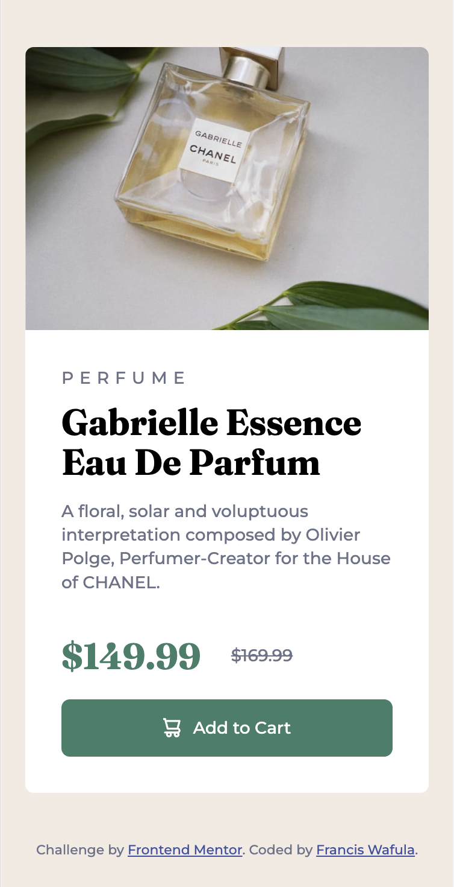

# Francis Wafula - BLANK WEB PAGE TEMPLATE

This the [BLANK WEB PAGE TEMPLATE](design/desktop-preview.png). Thanks for checking it out

## Table of contents 🧳

- [Overview](#overview)
  - [The objective](#the-objective)
  - [Screenshot](#screenshot)
  - [Links](#links)
- [My process](#my-process)
  - [Built with](#built-with)
  - [What I learned](#what-i-learned)
  - [Useful resources](#useful-resources)
- [Author](#author)

## Overview

This is a blank web page template, that contains all the files necessary for initializing a professional web project.

### The objective

If you intend to develop professional web applications or websites fast, this template can be useful for you. Use included files, documentation and content as initial files for other projects to quickly get moving. Key highlights are:

- A standard HTML template with all best practice tags and elements included
- SASS development environment setup for easy css coding
- Well organized folder and file setup
- Included prettier configuration file with best practice considerations for prettier code formatter ensuring standardized code, especially good for teams.
- Live development webserver included

### Screenshot

### Links

- Solution URL: [https://github.com/franco2ke/single-price-grid-component](https://github.com/franco2ke/single-price-grid-component)

## My process

I started by creating the html file based on the popular [HTML5 Boiler plate](https://html5boilerplate.com/). I customized the html to only have the most neccessary tags, elements for my intended purposes. Tags relating to PWAs were removed as well. Folder organization was next, ensuring folders for each webpage aspect, images, css, js etc.
A prettier code formatter exclusion was necessary to allow upto 120 characters per line for html code and overwrite the default 80. Just for html code.
A live-server and sass compiler were included to quicken development time.
To conclude the sass folder was implemented following the [7 - 1 Pattern by Kitty Giraudel](https://sass-guidelin.es/#the-7-1-pattern)

### Built with

- Semantic HTML5 markup
- CSS custom properties
- Flexbox
- CSS Grid
- Desktop first workflow
- [SASS](https://sass-guidelin.es) - Sassy Sass
- [BEM](http://getbem.com/introduction/) - BEM methodology
- node.js, npm, live-server, node-sass, npm-run-all

### What I learned

When starting a web based project, there are other things to consider apart from just the html, css and js code. It is important to also look at:
a. Search Engine Optimization
b. Social Media presentation
c. Site loading speed
The html meta tags when properly filled provide a head start on the above, and the most important ones are included

It's also a good idea to provided the site icons, and avoid having none or default wordpress, joomla and other CMS icons. This gives your site or app a more professional look. Necessary icon configurations for all browsers and iOS are included.

Documenting the code and explaining the why, allows easier understanding of the code when you go through it 2 month's later.

Starting and stopping of the live-server and sass compiler simplify the coding experience, improving coding productivity. The live-server automatically reloads page on every source file change.

- To start live web-server: % npm start

The current .gitignore file is populated with the necessary exclusions; files that should remain private and annoying system files.

The README makes a perfect starting point.

### Useful resources

- [Github Publishing](https://docs.github.com/en/pages/getting-started-with-github-pages/configuring-a-publishing-source-for-your-github-pages-site) - This simple article helped me with the details of posting my solution online. I found it quite simple to post using github pages.

## Author

- Website - [https://www.paon.co.ke](https://www.paon.co.ke)
- Twitter - [@franco2ke](https://twitter.com/franco2ke)

Happy Coding 🎯
